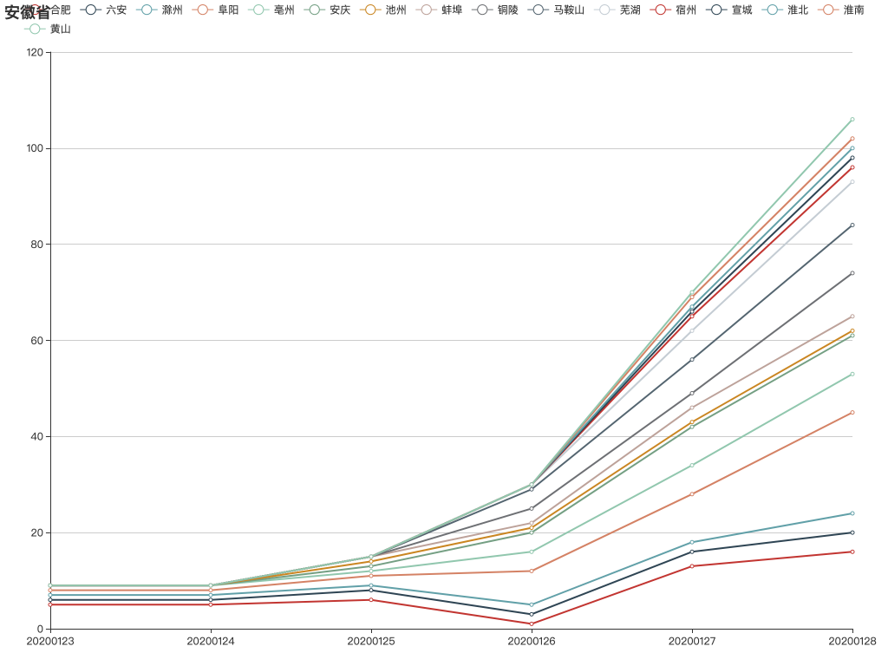

# 2019nCov-ProvincialMunicipalMonitoring
2019nCov 省级别展示

该项目数据来源于 http://lab.isaaclin.cn/nCoV


需安装 PHP 运行环境，来部署 ./build.php 做数据处理接口

简易运行可以在项目上级目录运行
```php
php -S localhost:63342 -t .
```

替换 index.js 中 data_url 请求地址

```javascript
npm run build
```

浏览器打开项目中 index.html

示例：



